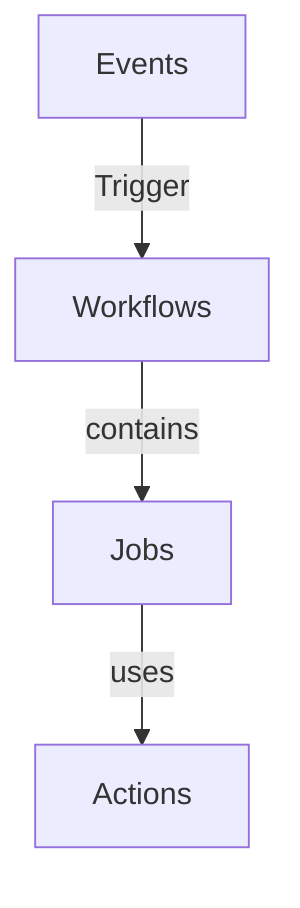

# GitHub Workflows 

## GitHub Actions flow

> Graph made using Mermaid markdown

 

## Syntax elements

* **Name:** The name of the workflow. GitHub displays the names of your workflows under your repository's "Actions" tab. If you omit name, GitHub displays the workflow file path relative to the root of the repository.
* **On:** To automatically trigger a workflow, use on to define which events can cause the workflow to run
* **Jobs:** A workflow run is made up of one or more jobs, which run in parallel by default. 
* **Runs-on:** Use jobs.<job_id>.runs-on to define the type of machine to run the job on.
* **Steps:** A job contains a sequence of tasks called steps. Steps can run commands, run setup tasks, or run an action in your repository, a public repository, or an action published in a Docker registry. Not all steps run actions, but all actions run as a step.
* **Uses:** Selects an action to run as part of a step in your job. An action is a reusable unit of code. You can use an action defined in the same repository as the workflow, a public repository, or in a published Docker container image.
* **Run:** Runs command-line programs that do not exceed 21,000 characters using the operating system's shell. If you do not provide a name, the step name will default to the text specified in the run command.

> Source: https://docs.github.com/en/actions/using-workflows/workflow-syntax-for-github-actions

 

## Workflow Status badge

Example from [blank.yml](https://raw.githubusercontent.com/CloudAndDevelopment/GitHubWorkflows/main/.github/workflows/blank.yml)

